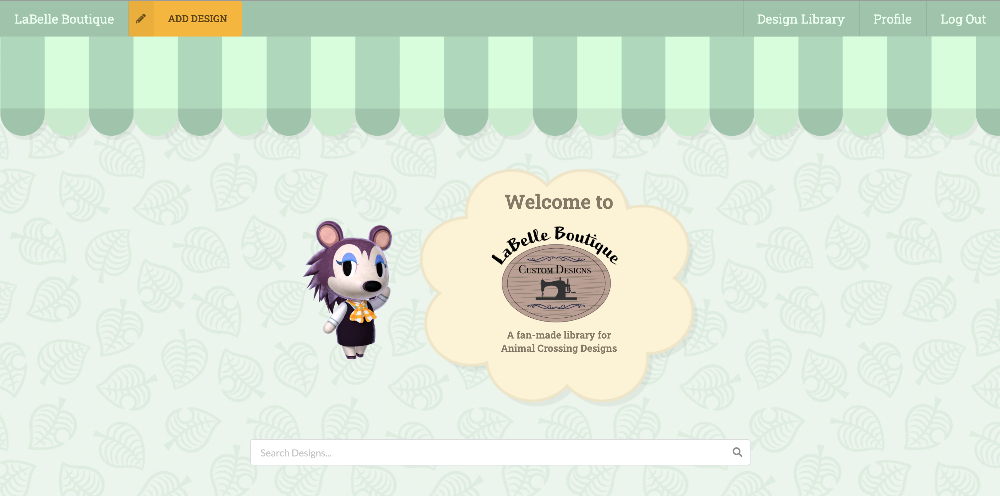
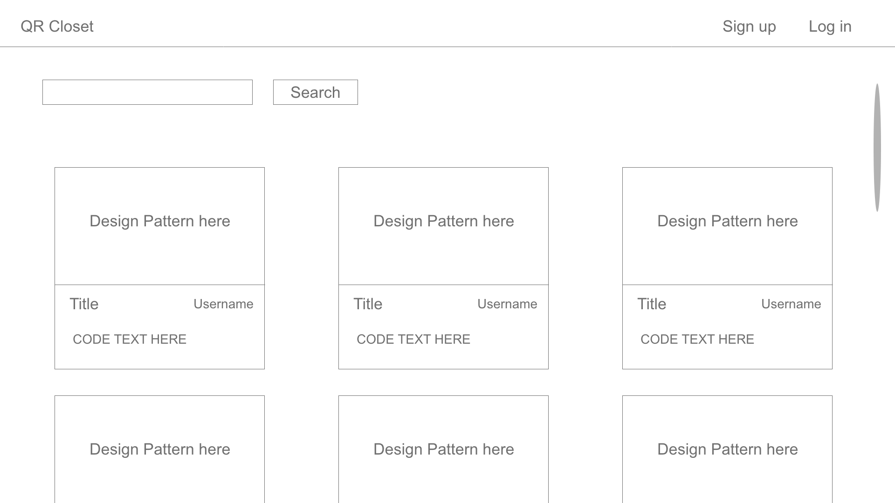
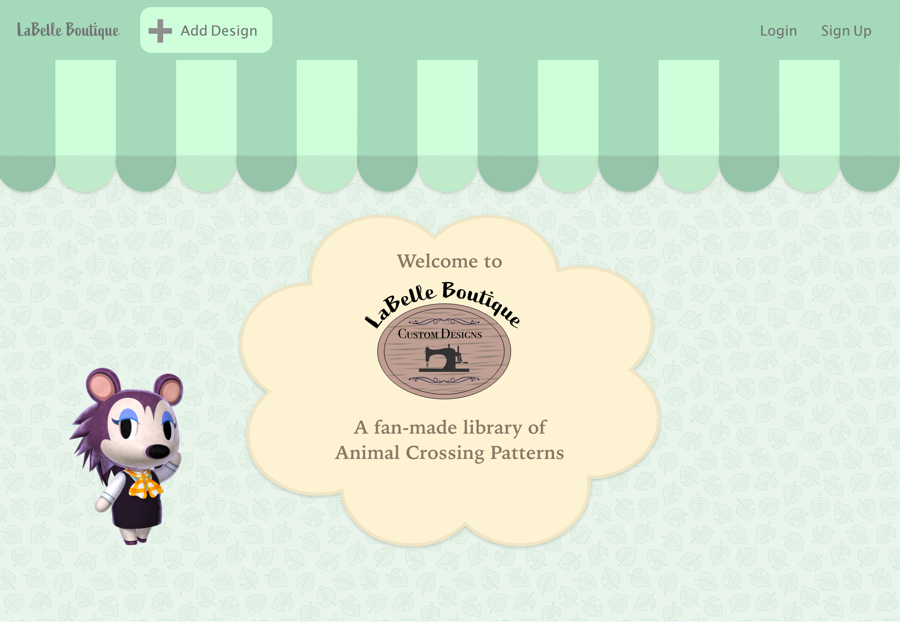
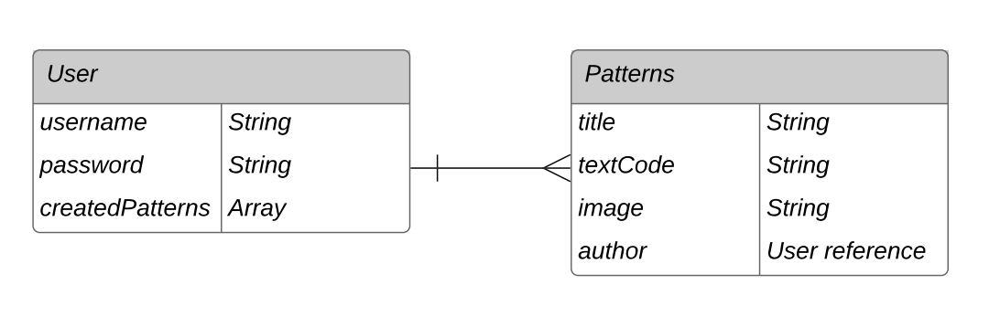

# LaBelle Boutique

Wish to find Animal Crossing custom designs or to share your own? LaBelle Boutique is a fan-made site hosting a library of user-created Animal Crossing patterns. Search for your favorite pattern by title on the home page, or log in and share your own!

---

## Technologies Used

- React
- Semantic UI
- CSS
- Javascript
- Node.js
- Express
- Mongoose
- MongoDB
- Express-session
- Bcryptjs
- Connect-mongo
- CORS
- dotenv
- body-parser

---

## User Story

A user should be able to...

- Sign up for an account
- Log in if they already have one
- Log out when they are done
- Reach a home page at ‘/’
  - search all designs via search bar
  - view all designs on site on home page
- Reach profile page at ‘/profile’
  - upload new designs
  - see their uploaded designs
  - Edit their designs info/images
  - Delete their designs

## Wireframes

### Initial Wireframes

#### Home Page

#### Profile Page

### Styles Wireframe

---

## Entity Relationship Diagram

---

## Future Features and Bugs to be Fixed

### Future Features

- Allow users to favorite designs and view favorite designs on profile
- Make profiles public w/ ability to search for users
- Ability to add tags to design posts and filter search by tags
- Navigation bar with categories of design types (ie hats, tops, tile)
- Infinite scrolling
- Cropping profile images

### Bugs to be Fixed

- Embedded data (images and posts) is not deleted on parent data deletion
- Active navbar elements will carry over on page redirects, even if the page is not correct
- ALL patterns are shown on the home page. This needs to be filtered into manageable chunks of limited number rather than all at once
- Pattern author links currently do nothing as public profiles have not been created yet
- Pattern Edit form Image input needs to be updated to an image upload button instead of an image url field
