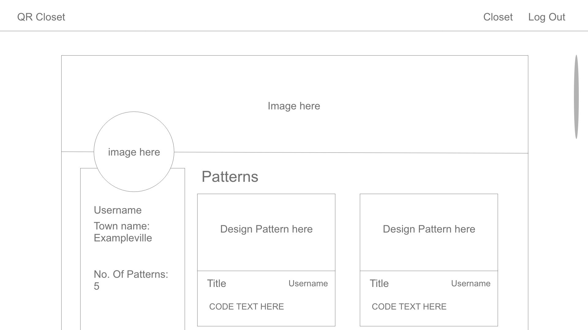

# LaBelle Boutique

---

## Technologies Used

- React
- Semantic UI
- CSS
- Javascript
- Node.js
- Express
- Mongoose
- MongoDB
- Express-session
- Bcryptjs
- Connect-mongo
- CORS
- dotenv
- body-parser

---

## User Story

A user should be able to...

- Sign up for an account
- Log in if they already have one
- Log out when they are done
- Reach a home page at ‘/’
  - search all designs via search bar
  - view all designs on site on home page
- Reach profile page at ‘/profile’
  - upload new designs
  - see their uploaded designs
  - Edit their designs info/images
  - Delete their designs

## Wireframes

### Home Page

### Profile Page

## Entity Relationship Diagrams

## Future Features and Known Bugs
